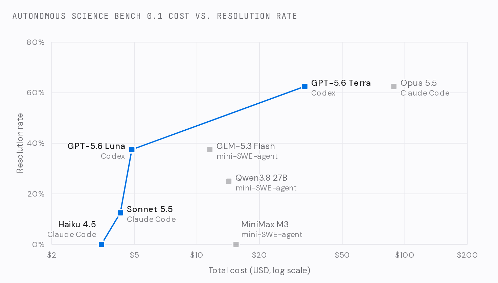
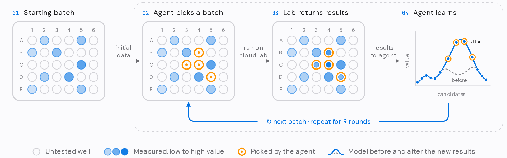

<h1 align="center">Autonomous Science Bench</h1>

<p align="center">
  <strong>Autonomous Science Bench</strong> evaluates AI agents for <strong>autonomous scientific discovery</strong> on real experimental workflows. Its campaigns are built on <strong>published experiments</strong> from research groups in biology, chemistry, and materials science, replayed or simulated behind a <strong>budgeted lab interface</strong>.
</p>
<p align="center">
  It is an <strong>interactive benchmark, not a dataset</strong>: an agent passes a campaign only if it both <strong>discovers</strong> good designs with the experiments it chooses and <strong>learns</strong> a model that ranks designs it never measured.
</p>

<p align="center">
  
  <a href="https://yibow.me/autonomous-science-bench/leaderboard"></a>
</p>

<!-- TODO: once the preprint is out, replace the badge row above with this one (arXiv link in place of TODO) and activate the links row.
<p align="center">
  <a href="TODO"></a>
  <a href="https://yibow.me/autonomous-science-bench/leaderboard"></a>
</p>

<p align="center">
  <a href="https://yibow.me/autonomous-science-bench/leaderboard">Project Page</a> ·
  <a href="TODO">arXiv</a>
</p>
-->

<p align="center">
  
</p>
<p align="center">
  <em>On the 0.1 pilot leaderboard (eight tasks, one trial each), two configurations lead at 63%. Each square is one configuration; the line traces the cost frontier, the best resolution rate reached at each budget. See the <a href="https://yibow.me/autonomous-science-bench/leaderboard">full leaderboard</a>.</em>
</p>

It measures how AI systems plan experiments, interpret measurements, and improve their decisions over time, and it evaluates the whole scientific system, from model and agent to tools, memory, and execution harness, on campaigns grounded in real experimental data. The first release sets a common evaluation framework and an initial set of expert-designed campaigns.

1. **From objective to experiment.** Turn a scientific goal into experiments the lab can actually run.
2. **Learning from sparse evidence.** Draw sound conclusions from limited, imperfect measurements.
3. **Reproducible progress.** Deliver improvements that hold up under real experimental constraints.

## Overview

Autonomous laboratories close the loop between AI reasoning and the physical world, running scientific models, experimental planning, automation, and measurement as one continuous cycle. Making them useful takes more than accurate prediction. An agent must:

- **Choose the evidence.** Decide which experiments are worth running.
- **Balance exploration and optimization.** Know when to search and when to exploit.
- **Adapt to surprises.** Respond when outcomes defy expectations.
- **Know the limits.** Recognize when the data cannot support a confident conclusion.
- **Respect the lab.** Stay within feasible operations, experimental costs, and measurement limits.

Autonomous Science Bench measures this through bounded **campaigns**. Each campaign gives an agent a scientific objective, an experimental interface, and a limited budget; success is what it achieves with the evidence and resources available. Each lab service supplies a structured interface, traceable execution, and measurable outcomes, and every gate is calibrated against baselines on the real data, so passing means real progress.

## An interactive benchmark, not a dataset

Every campaign exposes a **stateful, budgeted lab service** to the agent through one API, Autonomous Science Bench Lab API v1. The service decides what may be ordered, when, and at what cost, and it records every job in a ledger that the verifier later checks. The measurements come from a pluggable **backend**:

| Tier | Backend | Where measurements come from | Status |
|---|---|---|---|
| 1 | `replay` | Public experimental data held privately by the lab sidecar | ✅ v0.1 |
| 2 | `twin` | A digital twin: a hidden process model standing in for the lab | ✅ v0.1 (Sargent lab) |
| 3 | `live` | A physical lab, via asynchronous jobs | contract defined |

Swapping the backend does not change the instruction, the `asb` commands, or the ledger format. See [docs/ARCHITECTURE.md](docs/ARCHITECTURE.md).

## Campaigns

<p align="center">
  
</p>

Every campaign is a design-build-test-learn loop gated on two skills, and the reward is 1 only if every gate passes: **discovery**, judged on what the agent chose to measure, and **learning**, judged on the model it delivers, scored on designs it never measured.

| Campaign | Source | Domain | Backend | Budget |
|---|---|---|---|---|
| [nuclease-active-learning](tasks/biology/deepmind/nuclease-active-learning/README.md) | [DeepMind](sources/deepmind/README.md) | biology | replay | 4 × 96 enzyme variants |
| [biosensor-active-learning](tasks/biology/jewett-lab/biosensor-active-learning/README.md) | [Jewett lab](sources/jewett-lab/README.md) | biology | replay | 3 × 10 protein variants |
| [propylene-active-learning](tasks/chemistry/sargent-lab/propylene-active-learning/README.md) | [Sargent lab](sources/sargent-lab/README.md) | chemistry | twin | 3 × 20 dilute-alloy designs |
| [suzuki-condition-screen](tasks/chemistry/pfizer/suzuki-condition-screen/README.md) | [Pfizer](sources/pfizer/README.md) | chemistry | replay | 4 × 48 reaction-condition wells |
| [oer-composition-screen](tasks/materials/gregoire-lab/oer-composition-screen/README.md) | [Gregoire group](sources/gregoire-lab/README.md) | materials | replay | 4 × 48 oxide compositions |
| [coercivity-peak-search](tasks/materials/kusne-lab/coercivity-peak-search/README.md) | [Kusne group](sources/kusne-lab/README.md) | materials | replay | 4 × 16 alloy compositions |

Campaigns outside that scope are kept in [archive/](archive/README.md). They still run, but they are not in the dataset or the evaluation runs.

## Repository layout

```
runtime/             shared lab service, agent CLI, and verifier helpers (source of truth)
  asb_lab/           lab sidecar: API server, campaign rules, ledger, backends/
  asb_client/asb.py  `asb` CLI used by agents
  asb_verify/        ledger checks, ranking metrics, JS sandbox, reward writers
  sandbox/           Deno runner for untrusted JavaScript deliverables
  api/openapi.yaml   Autonomous Science Bench Lab API v1
  tests/             runtime unit tests
sources/<source>/    source cards (source.toml + README) for the groups whose published data back campaigns
tasks/<domain>/<source>/<campaign>/    Harbor tasks, one per campaign
archive/<domain>/<source>/<campaign>/  campaigns outside the benchmark's scope (not in the dataset)
evals/               agent × model presets, Harbor job runner, results summarizer
results/             evaluation outputs (gitignored)
tools/               vendor_runtime.py, run_local.py (Docker-free trial), update_digests.py
ci_checks/           static checks for campaign tasks
docs/                architecture notes and README figures
```

Each campaign is a standard [Harbor](https://harborframework.com/docs) task in the terminal-bench-science format. It has `task.toml`, `instruction.md`, `README.md`, and `environment/`, `solution/`, and `tests/` directories, a lab sidecar in `environment/lab/`, and a separate no-network verifier. Tasks must be self-contained, so `tools/vendor_runtime.py` copies the shared runtime into each one.

## Running

With Harbor and Docker:

```bash
uv tool install "harbor[modal,daytona]"
harbor run -p tasks/biology/jewett-lab/biosensor-active-learning --agent oracle   # expect reward 1
harbor run -p tasks/biology/jewett-lab/biosensor-active-learning --agent nop      # expect reward 0
harbor run -p tasks/biology/jewett-lab/biosensor-active-learning -a claude-code -m anthropic/claude-opus-5-5
```

Evaluate agents and models (Claude, GPT, Grok, Gemini, DeepSeek, GLM, Kimi, Qwen, …; presets follow the Terminal-Bench-Science leaderboard), with results saved to the gitignored `results/` folder:

```bash
uv sync --group eval && cp .env.example .env    # then add API keys
uv run python evals/run.py --suite sanity        # oracle = 1, nop = 0
uv run python evals/run.py --suite small --agent-timeout-multiplier 0.25
uv run python evals/run.py --suite frontier -k 3 --env modal
cat results/summary.md
```

See [evals/README.md](evals/README.md).

Without Docker, for development:

```bash
uv sync
uv run pytest
uv run python tools/run_local.py tasks/biology/jewett-lab/biosensor-active-learning --agent oracle --expect 1
```

## Contributing

See [CONTRIBUTING.md](CONTRIBUTING.md) to add a source or a campaign.

## Citation

If you use the Autonomous Science Bench, please cite it. The arXiv identifier will be added when the preprint is released.

```bibtex
@misc{asbench2026,
  title={Autonomous Science Bench: Evaluating {AI} Agents for Autonomous Scientific Discovery},
  author={{Autonomous Science Bench Team}},
  year={2026},
  howpublished={\url{https://yibow.me/autonomous-science-bench}},
  url={https://yibow.me/autonomous-science-bench},
}
```

## Acknowledgements

Autonomous Science Bench's task format and verifier conventions, and two archived campaigns (protein-active-learning and inverse-lithography), are adapted from [terminal-bench-science](https://github.com/harbor-framework/terminal-bench-science) (Apache-2.0). See [NOTICE](NOTICE).